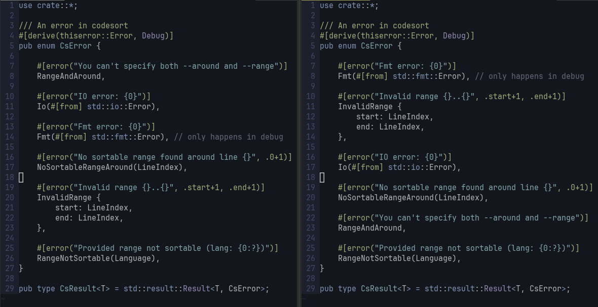

## Code-Sort

[![AGPL][s2]][l2] [![Latest Version][s1]][l1] [![Chat on Miaou][s4]][l4]

[s1]: https://img.shields.io/crates/v/codesort.svg
[l1]: https://crates.io/crates/codesort

[s2]: https://img.shields.io/badge/license-AGPL-blue.svg
[l2]: LICENSE

[s4]: https://miaou.dystroy.org/static/shields/room.svg
[l4]: https://miaou.dystroy.org/3490?codesort


Sometimes, an enum or a struct can become big enough that it's easier to keep track of its content and use, for example `match` arms, when the code is alphabetically sorted.

Of course you can't just sort lines if you want the code to keep working and the comments (and annotations, attributes, spacing, etc.) to follow the code.

Sorting code manually is a tedious and boring task.

**codesort** can sort struct fields, struct variants, enum variants, type declarations, match/switch arms of any kind, function declarations, etc.

Here's the before and after of sorting around the cursor's line:



## Examples

<details><summary>Sort the arms of a huge rust <code>match</code></summary>

</details>

<details><summary>Sort the variants of a rust enum</summary>

</details>

<details><summary>Sort the fields of a rust struct</summary>

</details>

<details><summary>Sort javascript function assignements</summary>

<i>Here, the range to sort has been visually selected.</i>
</details>


## Install codesort

Having Rust dev environment [installed](https://rustup.rs), run

```
cargo install codesort
```

## Usage

#### Sort around a line

```
codesort --around 25 src/my/file.rs
```

#### Sort from stdin, return to stdout

When no path is provided to codesort, specify the language using `--lang`/`-l`:

```
cat some/file.js | codesort -l js
```

## Code Editor Integration

By default, **codesort** takes the code to sort from stdin and writes the sorted code to stdout.

It can sort either the whole input, a given range (with `--range`), or select the best range around a given line (using `--around`).

You can also change the input and output to be files, with `--src` and `--dst`.

If necessary, you can provide a filename to codesort for langage detection (the file doesn't have to exist, only the extension of the name will be used, eg `.js`).

Those options make it easy to integrate codesort in any editor. See below for vim.

## Use codesort in vim

#### Sort the selection

When you don't want to sort the whole range (for example because there's a specific entry that you want to keep at the beginning), you can specify the range.

Visually select the selection, then type `:`, then `!codesort`.
This changes the input to

```
:'<,'>!codesort
```

Press the `enter` key: the selection is sorted with codesort.

#### Add a binding to sort around the current line

You don't usually have to select the zone to sort.
You can ask codesort to automatically select the zone to sort around your current line.

Define this binding in your vim configuration:

```
" sort the optimal range around the current line
" See https://github.com/Canop/codesort
nnoremap <Leader>cs ma<ESC>:execute ":%!codesort --around ".line('.')." --detect ".shellescape(expand('%:t'))<CR>`a

```

Typing the leader key then 'cs' will automatically select the set of blocs around the current line and sort it.

Explanation of the command:

* the current position is saved in the `a` register with `ma`
* the command including the line number is built then executed with `:execute`
* the codesort command takes the current line number through `--around`
* the codesort command takes the filename, for langage detection, through `--detect`
* the previous position is then restored

## Supported Code kinds

3 code analyzers are available now:

* Rust, which should work for Zig and C too
* Java
* JavaScript

If you want to use codesort in another language, ask or contribute.

## Licence

**codesort** is licenced under [AGPL-3.0](https://www.gnu.org/licenses/agpl-3.0.en.html).

You're free to use the **codesort** program to sort the code of your choice, even commercial.
